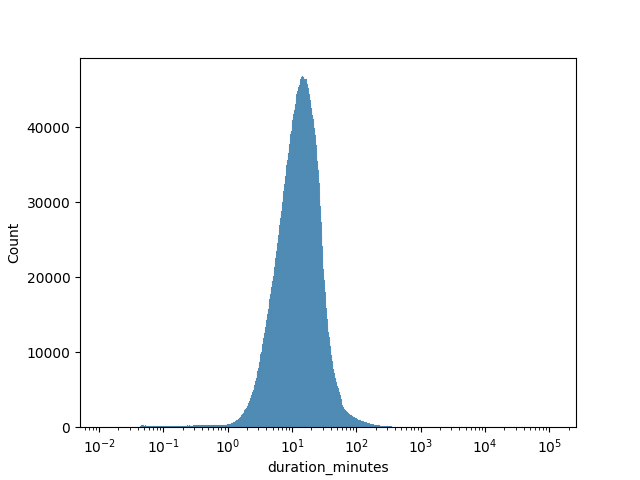
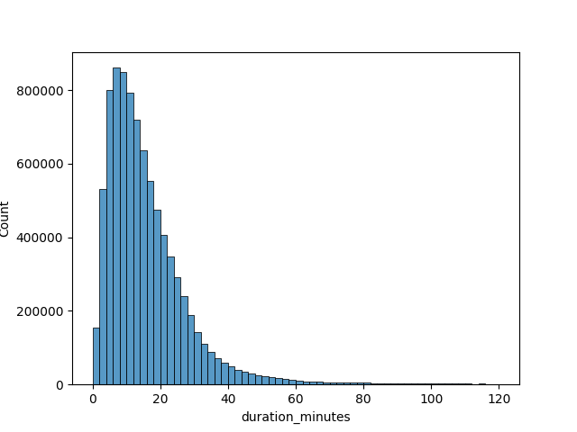
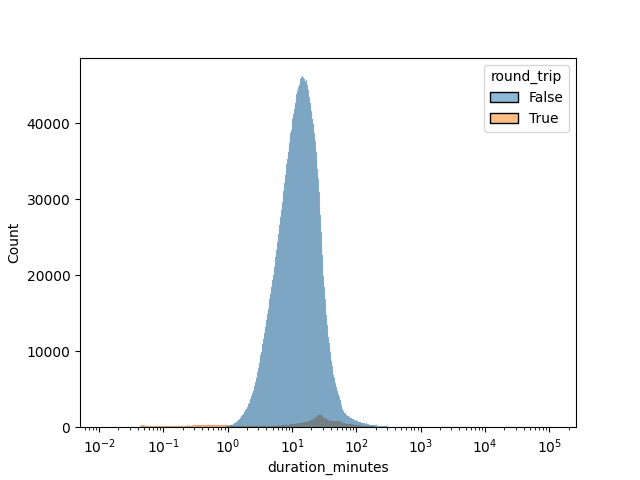
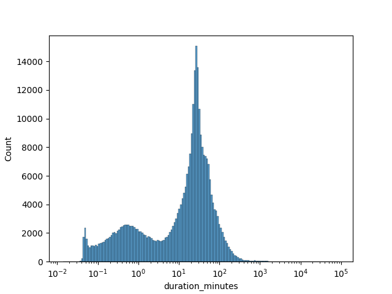
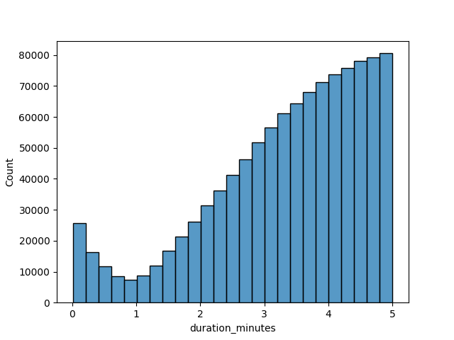
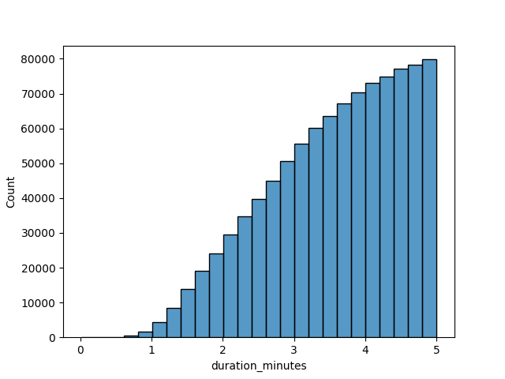

# Transport for London Cycling Data

Exploratory Data Analysis of the Transport for London (TfL) Cycling trip data.

## Overview

The main goal is to apply the knowledge aquired during the [Google Data Analytics Professional Certificate](https://www.coursera.org/professional-certificates/google-data-analytics) course, while keeping it simple enough to fit in the plaintext format of a github repository.

I will analyze a single year worth of data, to limit the scope of the analysis while I test the format of publication.

I will work with the 2024 year data since is the most recent complete year as the time of writting.

I will be working mainly with:

| Tool                                   | Use                                |
| -------------------------------------- | ---------------------------------- |
| [DuckDB](https://duckdb.org/)          | Parse, clean and query the dataset |
| [Mermaid](https://mermaid.js.org/)     | General purpouse diagrams          |
| [Seaborn](https://seaborn.pydata.org/) | Complex plots                      |

## Data Descripton

The data source is the [Transport for London (TfL) Open Data](https://tfl.gov.uk/info-for/open-data-users/our-open-data), in particular, their [cycling section](https://cycling.data.tfl.gov.uk/).

The data is published aggregating 2 weeks of data per CSV file (2 per month, 24 in a year).

### Schema

Every record in the dataset has the following fields:

| Field                | Data Type  | Role      | Description                                          |
| -------------------- | ---------- | --------- | ---------------------------------------------------- |
| Number               | UINT       | PK        | Record ID                                            |
| Start date           | DATETIME   | Attribute | Start of trip timestamp                              |
| Start station number | VARCHAR(6) | FK        | Start station ID                                     |
| Start station        | STRING     | Attribute | Name of start station                                |
| End date             | DATETIME   | Attribute | End of trip timestamp                                |
| End station number   | VARCHAR(6) | FK        | End station ID                                       |
| End station          | STRING     | Attribute | Name of end station                                  |
| Bike number          | UINT       | FK        | Bike ID                                              |
| Bike model           | STRING     | Attribute | Type of bike                                         |
| Total duration       | STRING     | Attribute | Human-readable representation of Total duration (ms) |
| Total duration (ms)  | UINT       | Attribute | Bike trip lenght in miliseconds                      |

### Download

Opening the [TfL cycling repositorty](https://cycling.data.tfl.gov.uk/) and executing the following script on the browser console will return an array with the desired 24 elements. After that, one could use many methods to actually download the CSV files.

```js
links = $$("a");
links.filter((e) => e.innerText.includes("2024.csv"));
```

To save disk space we compress eeach individual file using gzip.

```sh
ls data/*.csv | parallel -j 6 gzip -k {}
```

This reduces the dataset size from 1.4Gb to 300Mb.

## Data Preparation

Before analysis we must join all files into a convenient format that allows us freedom to query and transform the data. The tool of choice was DuckDB.

DuckDB allows us to:

- fast iteration while working on the CLI
- load csv data from zipped csv files
- export the data to multiple file formats such as duckdb, sqlite, csv and more.
- execute SQL queries stored in plaintext files against said database

### Attribute renaming

New values for the trip attributes is assigned at load time to simplify SQL query writting.

| Original Field Name  | New Field Name     | DuckDB type |
| -------------------- | ------------------ | ----------- |
| Number               | trip_id            | BIGINT      |
| Start date           | date_start         | TIMESTAMP   |
| Start station number | station_start_id   | BIGINT      |
| Start station        | station_start_name | VARCHAR     |
| End date             | date_end           | TIMESTAMP   |
| End station number   | station_end_id     | BIGINT      |
| End station          | station_end_name   | VARCHAR     |
| Bike number          | bike_id            | BIGINT      |
| Bike model           | bike_model         | VARCHAR     |
| Total duration       | duration_text      | VARCHAR     |
| Total duration (ms)  | duration_ms        | BIGINT      |

The SQL command to create the table

```sql
-- Create target table
CREATE TABLE trips_raw (
    trip_id BIGINT,
    date_start TIMESTAMP,
    date_end TIMESTAMP,
    station_start_id BIGINT,
    station_end_id BIGINT,
    station_start_name VARCHAR,
    station_end_name VARCHAR,
    bike_id BIGINT,
    bike_model VARCHAR,
    duration_text VARCHAR,
    duration_ms BIGINT,
);
```

### CSV formatting

There are 2 types of formatting between the 24 files, the 4 files from August and September beign the only odd ones.

The main format:

- quotes on every field
- 0-padded strings as IDs for Trips, Stations and Bikes
- Timestamp format is `YYYY-MM-DD HH:MM`

The secondary format:

- quotes only on station name fields
- non-0-padded integers as IDs for Trips, Staations and Bikes
- Timestamp format is `DD/MM/YYYY HH:MM`

A small sample file was created for each format, whitespace was added to improve readability:

- [format 0 sample](data/sample_format_0.csv)
- [format 1 sample](data/sample_format_1.csv)

### Data Load

After accounting for the attributes data types, name aliases and timestamp formatting differences, we arrive at 2 SQL statements to load the data.

A reduced version of the final query to load the secondary format files:

```sql
-- Load format_1 files
INSERT INTO trips_raw
    SELECT
        "Number" AS trip_id,
        ...
        "Total duration (ms)" AS duration_ms,
    FROM read_csv(
        'data/format_1/*.csv.gz',
        types={
            'Start date': TIMESTAMP,
            ...
            'Bike number': BIGINT,
        },
        timestampformat='%d/%m/%Y %H:%M'
    );
```

The [complete query](sql/01_load.sql) can be found on the [sql directory](sql), and can be run using:

```bash
duckdb --batch trips.duckdb < sql/01_load.sql
```

### Utility Attributes

To facilitate future analysis a few new atttributes will be created.

#### Route ID

To create a `route_id` we concatenate the 0-padded versions of the station IDs. After checking the maximun value of a station ID, 9 characters are enough to pad every value.

```sql
ALTER TABLE trips_raw
ADD COLUMN route_id VARCHAR;

UPDATE trips_raw
SET route_id = format('{:09d}{:09d}', station_start_id, station_end_id);
```

Using this scheme also ensures that the route from A to B is different from the route from B to A.

#### Trip duration in minutes

A quick check of the `duration_ms` attribute reveals that 75% of the values fall bellow 21 minutes.

```sql
SUMMARIZE -- DuckDb utility function
SELECT duration_ms/(1000 * 60)
FROM trips_raw;

-- Q25:  7.64 minutes
-- Q50: 13.05 minutes
-- Q75: 20.92 minutes
```

With this reference values I decided to add a calculated duration_minutes attribute to each record to facilitate filtering.

```sql
ALTER TABLE trips_raw
ADD COLUMN duration_minutes DOUBLE;

UPDATE trips_raw
SET duration_minutes = duration_ms/(1000 * 60);
```

### Round trip flag

A boolean column is added to quickly filter trips that start and end in the same location.

```sql
-- Add round trip flag
ALTER TABLE trips
ADD COLUMN round_trip BOOL DEFAULT false;

UPDATE trips
SET round_trip = (station_start_id == station_end_id);
```

## Exploratory Data Analysis

Here a general overview of the main attributes will be presented.

### Trip duration

Trip duration times range from a few seconds to many days. With most them falling under around 120 minutes.





#### Round-trips

Flagging trips with the same start and end station as round trips reveals some insigts.

Round trips are much less common than one-way trips.

```sql
SELECT
(station_end_id == station_start_id) AS round_trip,
count(*) as count
FROM trips_raw
GROUP BY round_trip;

┌────────────┬─────────┐
│ round_trip │  count  │
│  boolean   │  int64  │
├────────────┼─────────┤
│ false      │ 8434689 │
│ true       │  320463 │
└────────────┴─────────┘
```



Closer inspection of round trips reveals a double mode.



Some possible causes:

- **short trips**:
  - users changing their mind about using the bike
  - users testing the app functionality and/or the bikes themselves
  - users taking short trips around the block
- **average trips**:
  - users running errands
  - taking longer pleassure routes

#### Trips under 1 minute

There is an abundance of trips under 1 minute.



```sql
SELECT
(station_end_id == station_start_id) AS round_trip,
count(*) as count
FROM trips_raw
WHERE duration_ms / (1000 * 60) < 1
GROUP BY round_trip;

┌────────────┬───────┐
│ round_trip │ count │
│  boolean   │ int64 │
├────────────┼───────┤
│ false      │  2148 │
│ true       │ 67117 │
└────────────┴───────┘
```

Removing the round trips of less than 1 minute we get a more natural distrubution.



Without more information it's impossible to discern the quality of the remaining 2 thousand trips records. Some posibilities:

- The two stations are really close and make it possible to get between them in less than a minute.
- Data quality issue, assigning the wrong ID to the end station.

Going forward I will only focus on trips with durations:

- less or equal to 60 minutes
- different start and end locations if `duration_minutes` is less than 1 minute.

```sql
DELETE FROM trips
WHERE
duration_minutes > 60
OR
(duration_minutes < 1 AND station_start_id == station_end_id);
```
